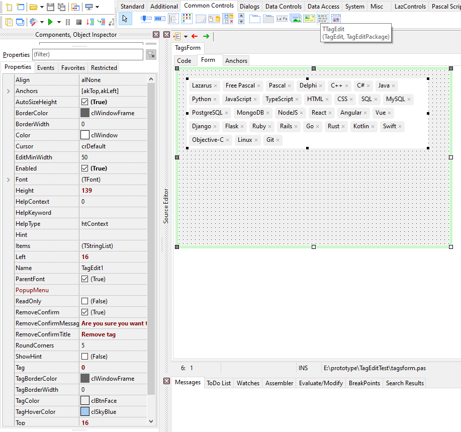
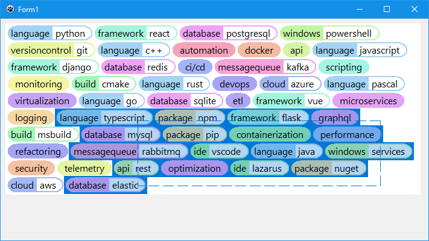

# TTagEdit Component

A versatile tag management control for Lazarus/FPC with advanced features.

[](https://opensource.org/licenses/MIT)
[](https://www.lazarus-ide.org/)
[](#)



## Features

- **🏷️ Tag Management**
  - Add tags by typing and pressing Enter
  - Tags with suffix (colon-separated)
  - Remove tags with click confirmation
  - Prevent duplicate tags
  - Multiple tag addition (semicolon-separated)
  - Programmatic tag management

- **🔄 Drag & Drop**
  - Rearrange tags via intuitive drag-and-drop
  - Visual drop indicators
  - Smooth repositioning
  - Configurable reordering

- **🎨 Customization**
  - Custom tag colors and hover effects
  - Adjustable border styles and widths
  - Rounded corners support
  - Random color for tag name if not defined
  - Tag color collection, assigns colors based on tag name match
  - Font and size customization
  - High DPI/PPI scaling support

- **📐 Smart Layout**
  - Automatic line wrapping
  - Dynamic edit box positioning
  - Optional auto-height adjustment
  - Responsive tag placement
  - Automatic height calculation

- **⚡ Interactive Features**
  - Hover effects with customizable colors
  - Click events for individual tags
  - Remove confirmation dialogs
  - Read-only mode support
  - Multi-tag selection support
  - Context menu integration
  - Clipboard operations

- **⌨️ Keyboard Support**
  - Enter to add tags
  - Backspace to remove last tag
  - Delete to remove selected tags
  - Escape to clear selection/edit
  - Ctrl+A to select all tags
  - Focus management

- **🎯 Selection System**
  - Multiple tag selection with mouse drag
  - Ctrl+Click for toggle selection
  - Visual selection rectangle
  - Customizable selection colors
  - Batch operations on selected tags



## Properties

| Property | Type | Description |
|----------|------|-------------|
| `Align` | TAlign | Control alignment within parent |
| `AllowReorder` | Boolean | Enable drag-and-drop tag reordering (default: True) |
| `AllowSelect` | Boolean | Enable tag selection functionality (default: True) |
| `Anchors` | TAnchors | Anchor points for responsive layout |
| `AutoColorBrightness` | Integer | Brightness percentage for auto-generated tag colors (0-100) |
| `AutoColorSaturation` | Integer | Saturation percentage for auto-generated tag colors (0-100) |
| `AutoColorSeed` | LongWord | Seed for stable random color generation |
| `AutoSizeHeight` | Boolean | Auto-adjust height based on content |
| `BackspaceEditTag` | Boolean | When pressing Backspace on empty edit, move last tag to edit box instead of removing |
| `BorderColor` | TColor | Component border color |
| `BorderWidth` | Integer | Component border width |
| `CloseButtons` | Boolean | Show close buttons on tags |
| `CloseButtonOnHover` | Boolean | Show close buttons only on hover |
| `Color` | TColor | Background color of the component |
| `DoubleBuffered` | Boolean | Reduce flickering with double buffering |
| `DragIndicatorColor` | TColor | Color of drag-and-drop indicator |
| `EditMinWidth` | Integer | Minimum width of edit box |
| `Enabled` | Boolean | Enable/disable the component |
| `Font` | TFont | Font used for tags and edit box |
| `Height` | Integer | Component height |
| `Items` | TStringList | Collection of tag strings |
| `ParentDoubleBuffered` | Boolean | Use parent's double buffering setting |
| `ParentFont` | Boolean | Use parent component's font |
| `PopupMenu` | TPopupMenu | Popup menu for the component |
| `ReadOnly` | Boolean | Read-only mode (no tag editing) |
| `RemoveConfirm` | Boolean | Show confirmation when removing tags |
| `RemoveConfirmMessage` | String | Message for remove confirmation dialog |
| `RemoveConfirmTitle` | String | Title for remove confirmation dialog |
| `RoundCorners` | Integer | Corner radius for tags |
| `SelectionColor` | TColor | Background color for selected tags |
| `SelectionRectColor` | TColor | Color of selection rectangle |
| `SelectionRectPenStyle` | TPenStyle | Pen style for selection rectangle |
| `SelectionRectWidth` | Integer | Width of selection rectangle border |
| `ShowHint` | Boolean | Show hint tooltips |
| `Tag` | Integer | User-defined tag value |
| `TagBorderColor` | TColor | Border color of tags |
| `TagBorderWidth` | Integer | Border width of tags |
| `TagColor` | TColor | Background color of tags |
| `TagColors` | TTagColorItems | Collection of custom tag colors |
| `TagHoverColor` | TColor | Color on mouse hover |
| `TagHoverUnderline` | Boolean | Underline tag text on hover |
| `TagSuffixColor` | TColor | Background color for tag suffix (after colon) |
| `TextHint` | String | Hint text shown in empty edit box |
| `Visible` | Boolean | Control visibility |
| `Width` | Integer | Component width |

## Events

| Event | Type | Description |
|-------|------|-------------|
| `OnChange` | TNotifyEvent | Occurs when tags collection changes |
| `OnClick` | TNotifyEvent | Occurs when component is clicked |
| `OnDblClick` | TNotifyEvent | Occurs when component is double-clicked |
| `OnKeyDown` | TKeyEvent | Occurs when key is pressed |
| `OnKeyPress` | TKeyPressEvent | Occurs when key is pressed (character) |
| `OnKeyUp` | TKeyEvent | Occurs when key is released |
| `OnMouseDown` | TMouseEvent | Occurs when mouse button is pressed |
| `OnMouseEnter` | TNotifyEvent | Occurs when mouse enters component |
| `OnMouseLeave` | TNotifyEvent | Occurs when mouse leaves component |
| `OnMouseMove` | TMouseMoveEvent | Occurs when mouse moves over component |
| `OnMouseUp` | TMouseEvent | Occurs when mouse button is released |
| `OnTagAdd` | TTagEvent | Occurs when a new tag is added |
| `OnTagClick` | TTagEvent | Occurs when a tag is clicked |
| `OnTagPopup` | TTagPopupEvent | Occurs when context menu is requested for a tag |
| `OnTagRemove` | TTagEvent | Occurs when a tag is removed |
| `OnTagReorder` | TTagReorderEvent | Occurs when a tag is reordered via drag-and-drop |

## Methods

| Method | Description |
|--------|-------------|
| `AddTag(const ATag: string)` | Add a new tag to the collection |
| `CalculateAutoHeight: Integer` | Calculate optimal height based on content |
| `ClearSelection` | Clear current tag selection |
| `CopyHoverText` | Copy hovered tag text to clipboard |
| `FinishEdit` | Force completion of current edit operation |
| `Focus: Boolean` | Check if control has focus |
| `GetTagsBitmap(...): TBitmap` | Generate bitmap representation of tags |
| `RemoveTag(const ATag: string; AConfirm: Boolean)` | Remove specific tag |
| `RemoveSelectedTags` | Remove all currently selected tags |
| `SelectAll` | Select all tags in the control |

## Installation

## Method 1: Through IDE
1. Open Lazarus IDE
2. Go to **Package** → **Open Package File (.lpk)**
3. Navigate to `TagEdit\packages\TagEditPackage.lpk`
4. Click **Open**
5. In the package window, click **Compile**
6. After successful compilation, click **Use** → **Install**
7. Restart Lazarus IDE

## After Installation
- The component will appear in the palette under "Common Controls" tab
- You can now drag TTagEdit component to your forms
- Use Object Inspector to customize properties

## Sample Usage

```pascal
// Basic setup
TagEdit1.Items.Add('Lazarus');
TagEdit1.Items.Add('FreePascal');
TagEdit1.Items.Add('Language:Pascal');

// Enable auto-height and selection
TagEdit1.AutoSizeHeight := True;
TagEdit1.AllowSelect := True;
TagEdit1.AllowReorder := True;

// Customize appearance
TagEdit1.TagColor := clSkyBlue;
TagEdit1.TagHoverColor := clLightBlue;
TagEdit1.RoundCorners := 8;
TagEdit1.TagBorderColor := clNavy;
TagEdit1.TagBorderWidth := 1;

// Selection customization
TagEdit1.SelectionColor := clHighlight;
TagEdit1.SelectionRectColor := clBlue;
TagEdit1.SelectionRectPenStyle := psDash;

// Configure remove confirmation
TagEdit1.RemoveConfirm := True;
TagEdit1.RemoveConfirmTitle := 'Delete Tag';
TagEdit1.RemoveConfirmMessage := 'Are you sure you want to remove this tag?';

// Set minimum edit width and text hint
TagEdit1.EditMinWidth := 10;
TagEdit1.TextHint := 'Type tags here...';

// Tag color customization
TagEdit1.TagColors.Add('Lazarus', clGreen);
TagEdit1.TagColors.Add('Pascal', clPurple);

// Advanced color settings
TagEdit1.AutoColorBrightness := 80;
TagEdit1.AutoColorSaturation := 80;
TagEdit1.AutoColorSeed := 12345; // For stable random colors

// Event handlers
procedure TForm1.TagEdit1OnTagAdd(Sender: TObject; const TagText: string);
begin
  ShowMessage('Tag added: ' + TagText);
end;

procedure TForm1.TagEdit1OnTagReorder(Sender: TObject; const TagText: string; const NewIndex: Integer);
begin
  ShowMessageFmt('Tag "%s" moved to position %d', [TagText, NewIndex]);
end;

// Programmatic operations
TagEdit1.AddTag('NewTag');
TagEdit1.RemoveTag('OldTag');
TagEdit1.SelectAll;
TagEdit1.RemoveSelectedTags;
TagEdit1.ClearSelection;

// Generate tag bitmap for preview
var
  Bitmap: TBitmap;
  Tags: TStringList;
begin
  Tags := TStringList.Create;
  try
    Tags.Add('Sample');
    Tags.Add('Tags');
    Tags.Add('Preview');
    Bitmap := TagEdit1.GetTagsBitmap(Tags, 12, 200, 100);
    try
      // Use bitmap as needed
      Image1.Picture.Bitmap := Bitmap;
    finally
      Bitmap.Free;
    end;
  finally
    Tags.Free;
  end;
end;